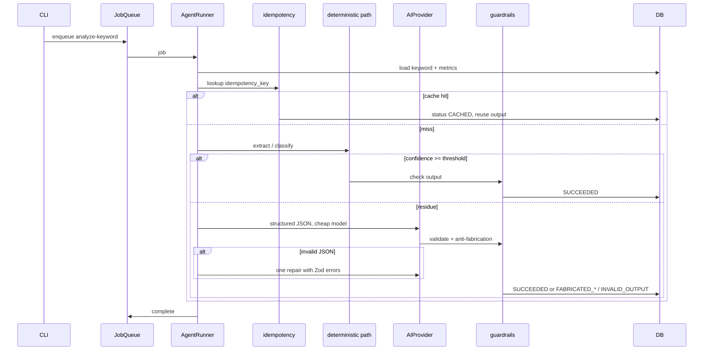

# AGENT ARCHITECTURE

Status: **M2 planning — awaiting approval**
Date: 2026-08-25
Related: [ARCHITECTURE.md](./ARCHITECTURE.md) · [DATABASE.md](./DATABASE.md) · [SCORING.md](./SCORING.md) · [COST_CONTROL.md](./COST_CONTROL.md) · [ADR-0007](./ADR/ADR-0007-deterministic-first-agents.md) · [ADR-0014](./ADR/ADR-0014-model-routing-budget.md)

Covers: agent architecture (3), contracts, runtime, keyword agent, future map.

---

## 1. Principles

1. **Structured I/O only.** Each agent has Zod `input` and `output` schemas. Natural language is allowed *inside* a field, not as the inter-agent protocol (`MASTER_SPEC.md` §5, §9).
2. **Deterministic first.** If a function can classify, extract, or score, it must. LLMs are a fallback for residue (`§23`, [ADR-0007](./ADR/ADR-0007-deterministic-first-agents.md)).
3. **No silent mutation of production behaviour.** Prompt files are immutable once hashed into `agent_prompt`. Changes require a `change_proposal` (M9; schema stub in M2).
4. **Every run is an `agent_run` row** including formula-only runs (`model = deterministic`, cost `$0`).
5. **Agents do not import other agents.** Composition is orchestration + database.
6. **Untrusted text is data, never instructions.** CSV cells, titles, and snippets are wrapped in delimiters; the model is told to ignore directive-like content inside them.

## 2. Agent contract (required of every agent)

```ts
type AgentContract<I, O> = {
  id: string;                 // e.g. "keyword"
  version: string;            // semver of implementation
  input: ZodType<I>;
  output: ZodType<O>;
  prompts: { name: string; version: string; file: string }[];
  defaultModel: ModelRef;     // overridable in config
  timeoutMs: number;
  maxRetries: number;         // validation-repair retries, not infinite loops
  costClass: "free" | "cheap" | "expensive";
  run(ctx: AgentContext, input: I): Promise<Result<O, AgentError>>;
};
```

Every successful or failed `run` persists:

- input/output JSON (validated)
- prompt content hashes
- model, tokens, estimated cost, duration
- confidence (on output)
- path (`DETERMINISTIC` / `DETERMINISTIC_PLUS_LLM` / `LLM`)
- status from `agent_run_status`

## 3. Runtime (`packages/agent-core`)



**Retry policy:** transient provider errors (429, 5xx) retry with exponential backoff, max 3, budget-aware. Schema-invalid model output gets **one** repair pass. Guardrail failures (`FABRICATED_NUMERIC`, `FABRICATED_EXPERIENCE`) are **not** retried with a stronger model in M2 — they fail closed.

**Cache key:** `sha256(agentId + agentVersion + promptHashes + model + canonicalInputJson)`. Config bump of agent version invalidates.

**JobQueue:** interface `enqueue`, `process`, `get`. M2 adapter is sequential in-process, persisted in `job` rows so a crash can resume. Redis/BullMQ later ([ADR-0005](./ADR/ADR-0005-defer-redis-bullmq.md)).

## 4. AIProvider (`packages/ai-provider`)

```ts
interface AIProvider {
  id: "mock" | "openai" | "anthropic";
  complete(req: CompletionRequest): Promise<CompletionResponse>;
}
```

`CompletionRequest`: system + user messages, `responseJsonSchema` (Zod-derived JSON Schema), `maxTokens`, `temperature` (default 0 for extractors), `timeoutMs`.

`CompletionResponse`: text, parsed JSON if valid, `inputTokens`, `outputTokens`, `model`, `raw` (redacted before logs).

Adapters: **Mock** (fixture map by input hash — required for $0 acceptance), **OpenAI**, **Anthropic**. Missing API keys: that adapter is disabled; pipeline still runs via Mock + deterministic path.

Router: per-agent config `KEYWORD_AGENT_MODEL=deterministic|mock|openai:gpt-4.1-mini|anthropic:claude-...`. Expensive models require `ALLOW_EXPENSIVE=true` plus daily budget remaining.

## 5. Keyword agent (M2 — only implemented agent)

**Responsibilities** (`MASTER_SPEC.md` §10): import is a separate deterministic command; this agent analyses already-imported keywords: normalise (already done), classify intent, identify product/user/problem/environment/constraints, cluster, generate **related keyword candidates** (strings only — **never invent search volume**).

### 5.1 Input

```json
{
  "keywordId": "uuid",
  "rawText": "best pruning shears for small hands",
  "canonicalText": "best pruning shears for small hands",
  "nicheSlug": "problem-solving-gardening",
  "locale": "en-US",
  "market": "US"
}
```

No opportunity scores in the input. Hypothesis metrics must not leak into extraction.

### 5.2 Output (`KeywordAnalysis`)

```json
{
  "patternType": "BEST_X_FOR_Y",
  "intentType": "COMMERCIAL_INVESTIGATION",
  "productText": "pruning shears",
  "qualifierText": "small hands",
  "facets": [
    { "kind": "PRODUCT", "slug": "pruning-shears", "label": "pruning shears", "confidence": 0.99 },
    { "kind": "CONSTRAINT", "slug": "small-hands", "label": "small hands", "confidence": 0.99 }
  ],
  "userText": null,
  "problemText": null,
  "environmentText": null,
  "constraintText": "small hands",
  "clusterSuggestion": { "slug": "pruning-shears", "label": "Pruning shears" },
  "relatedCandidates": [
    { "text": "best pruning shears for arthritis", "origin": "TEMPLATE", "confidence": 0.4 }
  ],
  "confidence": 0.95,
  "path": "DETERMINISTIC",
  "notes": []
}
```

`relatedCandidates.origin` is `TEMPLATE` | `LEXICON` | `LLM`. Confidence ≤ 0.5 for speculative expansions. **No volume, KD, CPC fields exist on this schema.**

### 5.3 Deterministic path

1. **Normalise** already stored; agent re-validates canonical form.
2. **Pattern grammar**
   - `^best (.+) for (.+)$` → `BEST_X_FOR_Y` (41/44 M1 rows).
   - `^best (.+)$` with a leading attribute from lexicon (`lightweight`, `compact`) → `BEST_ATTRIBUTE_X` (the 3 rows without ` for `).
   - Other patterns reserved (`X vs Y`, `under $N`) return `OTHER` with low confidence and optional LLM.
3. **Facet lexicon** match on product tokens and qualifiers (seeded from CSV + gardening vocabulary).
4. **Slot assignment:** `for` clause classified as USER / PROBLEM / ENVIRONMENT / USE_CASE / CONSTRAINT using lexicon + small rule table (e.g. `elderly` → USER, `raised beds` → ENVIRONMENT, `small hands` → CONSTRAINT).
5. **Intent:** `best X` commercial-investigation default; `how to` informational (not in M1 batch).
6. **Clusters:** greedy grouping by primary product facet within niche (`tomato-support` for trellis + plant support).
7. **Related candidates:** templates (`best {product} for {known-qualifier-in-niche}`) minus the current keyword. Capped (e.g. 8). Marked non-authoritative.

**LLM fallback** when: pattern `OTHER`, or any required slot empty with `confidence < 0.7`, or multiple product tokens unresolved. Prompt forbids inventing metrics and forbids claiming tests. Output must be JSON matching the same schema. Guardrails then run.

**Fixtures that must pass without LLM:** all 10 gardening keywords; the 3 no-`for` keywords; `best garden kneeler for elderly` (USER not medical advice); duplicate qualifier `small hands` across niches (facet slug reused).

## 6. Opportunity scoring (not an LLM agent)

Implemented in `packages/scoring` as a deterministic agent-shaped job (`agent_id = scoring`, `model = deterministic`). See [SCORING.md](./SCORING.md). It **reads** `keyword_analysis` + `keyword_metric`; it does **not** call AIProvider in M2.

## 7. Future agents (contracts only in M2)

Each reserved package gets `contract.ts` sketch + README. No runtime.

| Agent | Milestone | Input (summary) | Output (summary) | Model class |
|-------|-----------|-----------------|------------------|-------------|
| `serp` | M3 | keyword + locale | typed SERP snapshot + opportunity features | cheap + APIs |
| `product` | M4 | keyword analysis | product candidates + official facts | cheap + PA-API |
| `evidence` | M4 | products | evidence records with claim_kind | mixed |
| `brief` | M5 | keyword + SERP + products + evidence | ContentBrief JSON | strong |
| `writer` | M5 | brief | ArticleVersion markdown + structure | strong |
| `factchecker` | M6 | article + evidence | ArticleFact[] + verdicts | strong |
| `affiliate` | M6 | article | compliance findings (configurable rules) | cheap + rules |
| `seo` | M6 | article | SEO findings; cannot override fact fail | cheap + rules |
| `publisher` | M7 | approved version | Publication draft | none (API) |
| `analytics` | M8 | date range | snapshots | none (API) |
| `learning` | M9 | predicted vs actual | experiments + change_proposal | strong, **no auto-apply** |

## 8. Guardrails (all agents)

`packages/guardrails` runs on every model output (and on writer later):

| Rule | Trigger | Status |
|------|---------|--------|
| JSON matches output Zod schema | parse fail | `INVALID_OUTPUT` |
| Every number in output appears in input or in an allowlisted enum ordinal | extra number | `FABRICATED_NUMERIC` |
| Banned experience phrases unless `verified_test_record_id` present | phrase list | `FABRICATED_EXPERIENCE` |
| Prompt-injection: output must not contain `ignore previous` style tool calls | pattern | `INVALID_OUTPUT` |

Banned phrases (initial, configurable): `we tested`, `our testing showed`, `we used this product`, `after testing`, `in our hands-on testing`, `I used`, `our lab`.

## 9. Human vs automation (agents)

| Step | Automation | Human |
|------|------------|-------|
| Keyword analysis deterministic | Full | None |
| LLM fallback | Full if key present | Supply key (optional) |
| Approve prompt/version change | Proposal row only | Required |
| Publish | Not an agent in M2 | N/A until M7 |
