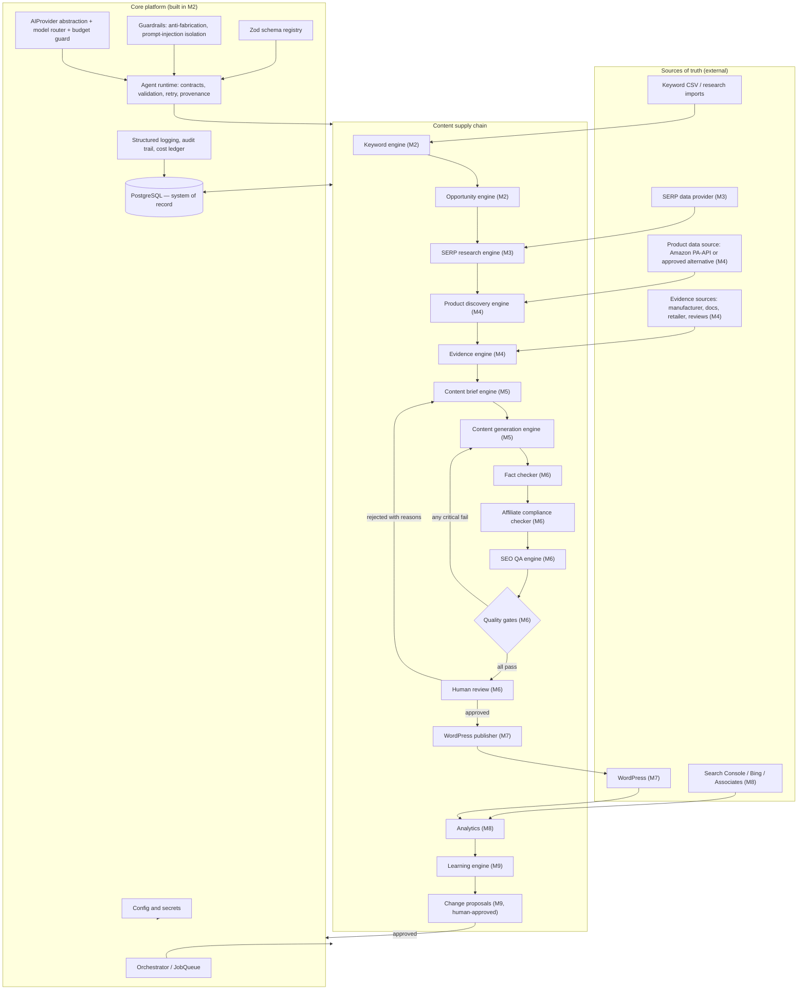
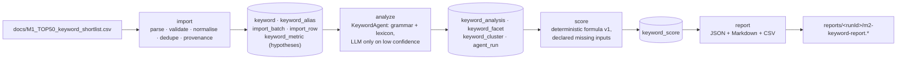
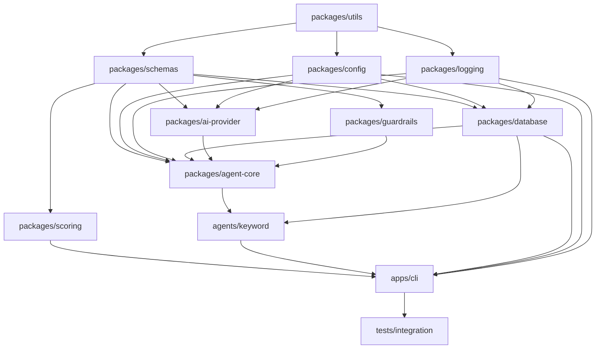
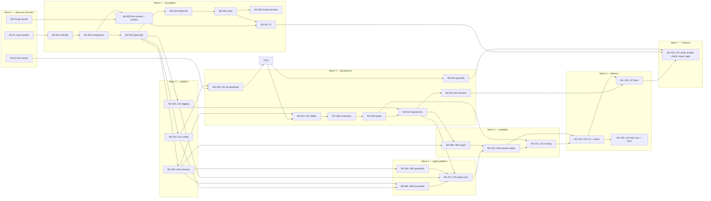

# SYSTEM ARCHITECTURE

Status: **M2 planning — awaiting approval**
Date: 2026-08-25
Related: [MASTER_SPEC.md](./MASTER_SPEC.md) · [DATABASE.md](./DATABASE.md) · [AGENTS.md](./AGENTS.md) · [SCORING.md](./SCORING.md) · [SECURITY.md](./SECURITY.md) · [COST_CONTROL.md](./COST_CONTROL.md) · [ADR index](./ADR/README.md)

Covers: proposed architecture (1), repository structure (4), technology choices and alternatives (5), dependency graph (9).

---

## 1. Architectural goals and the forces behind them

The system is a **content supply chain**: a keyword becomes a scored opportunity, becomes researched evidence, becomes a brief, becomes an article, becomes a published page, becomes measured performance, becomes a learning signal. Five forces dominate the design.

1. **Truth is the product.** The commercial value of the site collapses if it publishes fabricated specifications, invented test claims or made-up prices. Provenance is therefore not a logging concern, it is a schema concern (`MASTER_SPEC.md` §1.1, §1.2). Every number in the system either has a source row or does not exist.
2. **Steps are expensive and repeated.** LLM calls, SERP calls and product-API calls cost money and are rate-limited, while the pipeline will be re-run constantly during development. Caching, idempotency and deterministic replacement of model calls are structural requirements, not optimisations (§23).
3. **The pipeline is long and will fail partway.** Any stage can fail on any item. State must live in the database, not in process memory, so that a re-run resumes rather than restarts.
4. **Humans hold the publish gate.** Approval is a modelled state transition with an audit trail, not a convention (§1.3, §28).
5. **The system must be able to critique itself later.** Predictions must be stored *as predictions*, with the model/prompt/formula version that produced them, or the M9 learning loop has nothing to compare against (§1.4, §21).

The consequence of forces 1, 3 and 5 is the central architectural choice: **the database is the integration bus.** Agents do not stream prose to one another. Each agent reads typed rows, writes typed rows, and records how it produced them (§5: "Avoid passing large uncontrolled natural-language blobs between agents").

## 2. Logical architecture

The spec's pipeline is preserved, with the addition of an explicit orchestration layer and the cross-cutting concerns each stage depends on.



Two properties of this diagram matter more than the boxes:

- **The only cycle that mutates system behaviour passes through a human.** `Learning engine → Change proposal → approval → core platform` is the sole path by which prompts, weights or rules change (§22). Nothing else writes to prompts or scoring formulas.
- **Failure edges are explicit.** A quality-gate failure returns to the writer with structured reasons (§28), and a human rejection returns to the brief stage. These are modelled state transitions, so a rejected article's history is queryable.

## 3. What M2 actually builds

M2 delivers the left column of the pipeline plus the whole core platform. The acceptance run is a single command:



Every arrow is idempotent: re-running with the same input produces the same rows and the same report bytes. That property is itself an acceptance test ([RUNBOOK.md](./RUNBOOK.md) §4).

Deliberately **not** in M2: any HTTP API, any web UI, any Redis, any external data provider, any content generation. See [ASSUMPTIONS.md](./ASSUMPTIONS.md) §7.

## 4. Layering rules

Four layers, with a strict one-way dependency rule enforced by lint (`import/no-restricted-paths`) so the architecture cannot silently erode:

| Layer | Contents | May depend on |
|-------|----------|---------------|
| L1 Foundation | `config`, `logging`, `utils`, `schemas` | L1 only |
| L2 Platform | `database`, `ai-provider`, `agent-core`, `guardrails`, `scoring` | L1 |
| L3 Capability | `agents/*` (keyword, serp, product, …) | L1, L2 |
| L4 Application | `apps/cli`, later `apps/worker`, `apps/api`, `apps/web` | L1, L2, L3 |

Consequences: an agent may never import another agent (they compose only at L4 or via the database); nothing outside `packages/database` may build SQL; nothing outside `packages/ai-provider` may hold a vendor SDK; `packages/schemas` may not import the database (schemas are the contract, not a projection of storage).

## 5. Repository structure

npm workspaces monorepo ([ADR-0001](./ADR/ADR-0001-monorepo-npm-workspaces.md)). Directories marked *reserved* are created with only a README so the intended shape is visible without shipping dead code.

```
affiliate-seo-engine/
├─ package.json                    # workspaces, shared scripts, engines: node >=22
├─ package-lock.json               # committed; CI uses npm ci
├─ tsconfig.base.json              # strict, ESM, project references
├─ eslint.config.js                # flat config + layer boundary rules
├─ vitest.config.ts                # workspace-wide test + coverage gates
├─ .gitignore .gitattributes .editorconfig .nvmrc
├─ .env.example                    # every variable, no real values
├─ README.md CONTRIBUTING.md LICENSE
│
├─ apps/
│  ├─ cli/                         # M2 entrypoint: the only runnable app in M2
│  │  ├─ src/commands/             # import · analyze · score · report · pipeline · db · tasks
│  │  ├─ src/bootstrap.ts          # config load → logger → db → registry wiring
│  │  └─ src/index.ts
│  ├─ worker/  (reserved, M3)      # long-running queue consumer
│  ├─ api/     (reserved, M7)      # HTTP surface for review UI + webhooks
│  └─ web/     (reserved, M6)      # Next.js human-review console
│
├─ agents/
│  ├─ keyword/                     # M2 — the only implemented agent
│  │  ├─ src/contract.ts           # id, version, input/output Zod schemas
│  │  ├─ src/deterministic/        # pattern grammar, facet lexicon, intent rules
│  │  ├─ src/llm/                  # fallback prompt + parser (optional path)
│  │  ├─ src/cluster.ts
│  │  ├─ prompts/                  # versioned .md prompt files, immutable
│  │  └─ test/
│  ├─ serp/ product/ evidence/ brief/ writer/
│  ├─ factchecker/ affiliate/ seo/ publisher/
│  └─ analytics/ learning/         # all reserved with README + contract sketch
│
├─ packages/
│  ├─ config/                      # Zod-validated env, profiles, budgets, feature flags
│  ├─ logging/                     # pino JSON logger, trace ids, redaction, audit writer
│  ├─ schemas/                     # shared Zod contracts + provenance primitives
│  ├─ database/                    # Drizzle schema, migrations, repositories, test harness
│  ├─ ai-provider/                 # AIProvider interface, adapters, model registry, router
│  ├─ agent-core/                  # AgentRunner, retry/repair, cache, cost, prompt registry
│  ├─ guardrails/                  # anti-fabrication + untrusted-input handling
│  ├─ scoring/                     # versioned deterministic scoring models
│  └─ utils/                       # ids, hashing, result type, clock, csv, text normalise
│
├─ docs/                           # this planning set (see M2_PLAN.md for the index)
├─ tests/
│  ├─ integration/                 # cross-package: full pipeline runs
│  ├─ fixtures/                    # CSVs, mock LLM responses, golden reports
│  └─ helpers/
├─ scripts/                        # Node-only cross-platform maintenance scripts
└─ reports/                        # gitignored pipeline output
```

Deviations from `MASTER_SPEC.md` §6 and why: `apps/cli` is added because M2's deliverable is a command, not a server; `apps/web` and `apps/api` are deferred ([ADR-0006](./ADR/ADR-0006-defer-web-app.md)); `packages/prompts` is **not** created — prompts live next to the agent that owns them, versioned in `agents/*/prompts/`, because a central prompt package would couple every agent to every prompt change; `packages/guardrails` and `packages/scoring` are added because both are cross-agent policy that must not be duplicated per agent.

## 6. Technology choices and alternatives

Where the spec recommended a technology, the recommendation is followed unless the local environment makes it unrunnable. Each deviation has an ADR.

| Concern | Choice | Alternatives considered | Why this one |
|---------|--------|------------------------|--------------|
| Language / runtime | TypeScript 5.x on Node 22 LTS, ESM | Python; Go; Deno; Bun | Spec-recommended; Node 22 verified present; Python not installed; one language across CLI, agents and a future Next.js UI keeps the Zod contracts genuinely shared rather than duplicated. |
| Monorepo tooling | npm workspaces | pnpm + Turborepo; Nx; single package | npm 10.9 verified present, pnpm absent; pnpm's symlink layout is hostile to OneDrive; the repo is small enough that Turborepo's caching is not yet worth the config. Revisit when CI exceeds ~5 min. [ADR-0001](./ADR/ADR-0001-monorepo-npm-workspaces.md) |
| Database | PostgreSQL 16 dialect | SQLite; MySQL; MongoDB; DuckDB | Spec-recommended. Concretely needed: `jsonb` for agent payloads, arrays for synonyms, enums, partial unique indexes (one active version per entity), `numeric` money, CTEs for cluster queries. |
| Local DB runtime | **PGlite** (embedded Postgres/WASM) for dev + tests; real Postgres for staging/prod | Docker Compose Postgres; hosted Neon/Supabase; SQLite for dev | Docker is not installed and needs admin rights + WSL2; without this choice the M2 acceptance run cannot be executed on this machine at all. PGlite runs the real Postgres engine, so the dialect stays honest, and a parity job runs the same migrations against real Postgres. [ADR-0004](./ADR/ADR-0004-pglite-local-postgres-prod.md) |
| ORM / migrations | Drizzle ORM + drizzle-kit | Prisma; Kysely; raw SQL + node-pg-migrate | Spec allows either. Prisma's `migrate dev` requires a live shadow DB (impossible here today) and adds an engine binary; Drizzle emits plain SQL migrations, runs on PGlite and node-postgres from one schema, and its TS-first schema pairs with `drizzle-zod` for DB↔contract parity tests. [ADR-0003](./ADR/ADR-0003-drizzle-over-prisma.md) |
| Validation | Zod | io-ts; Valibot; JSON Schema + Ajv; TypeBox | Spec-recommended; doubles as the LLM structured-output schema and the CLI argument validator, so one definition guards all three boundaries. |
| Queue | `JobQueue` interface + in-process sequential runner in M2; BullMQ adapter in M3+ | Redis + BullMQ now; pg-boss; Temporal | Redis needs Docker. M2's workload is a bounded batch of ~44 items where ordering aids reproducibility. pg-boss is the likely M3 pick if Redis remains unavailable — hence the interface. [ADR-0005](./ADR/ADR-0005-defer-redis-bullmq.md) |
| CLI | commander + a thin typed-args wrapper | oclif; yargs; clipanion | Small, no codegen, no plugin framework needed for six commands. |
| Logging | pino → JSON on stdout, plus `audit_event` rows for state changes | winston; console.log; OpenTelemetry now | Spec requires structured JSON. pino is fast and has first-class redaction, which the secret-hygiene rules need. OTel is deferred until there is a service to trace. [ADR-0011](./ADR/ADR-0011-structured-logging-pino.md) |
| Testing | Vitest (unit + integration), Playwright reserved for M6 web | Jest; node:test | Spec-recommended; native ESM + TS, fast watch, built-in coverage. Playwright has nothing to drive until a UI exists. |
| LLM access | own `AIProvider` interface; adapters for OpenAI and Anthropic | LangChain; Vercel AI SDK; direct SDK calls | §24 demands no hard-coding to one model. A hand-rolled interface is ~200 lines, keeps token/cost accounting exact, and avoids a large dependency whose abstractions change faster than the vendors'. [ADR-0014](./ADR/ADR-0014-model-routing-budget.md) |
| Containerisation | Dockerfile + compose committed but **not required** to run M2 | Docker-first development | Keeps the spec's deployment story available for whoever has Docker, without making the local acceptance run depend on it. |
| Secrets | `.env` (gitignored) + Zod validation at boot + log redaction | committed config; cloud secret manager | Correct for a single-operator local tool; the `SecretSource` seam allows a manager later. See [SECURITY.md](./SECURITY.md). |

### Rejected outright

**LangChain / agent frameworks with autonomous tool loops.** The safety model here is the opposite of open-ended agency: every agent has a fixed input schema, a fixed output schema and no tool-calling freedom. An autonomy framework would add a large dependency while making cost and provenance harder to account for.

**A vector database / embeddings store in M2.** Nothing in M2 needs semantic retrieval; clustering 44 keywords is a string/facet problem. Revisit at M5 for internal-link suggestion, where `pgvector` on the existing Postgres is the natural first step rather than a new service.

**Storing article bodies as files.** Versioned content belongs in `article_version` rows so QA results, facts and publication records can reference an immutable version id.

## 7. Cross-cutting concerns

**Identity.** UUID v7 primary keys everywhere: time-ordered (index locality, human-sortable logs) while remaining generatable client-side, which matters because a batch import assigns ids before any insert.

**Idempotency.** Every ingest and agent step derives a deterministic key: `import_batch` from the file SHA-256, `keyword` from a canonical-form hash, `agent_run` from a hash of (agent id, agent version, prompt hashes, model, normalised input). Re-running is a cache hit, not a duplicate row.

**Provenance.** A single reusable column group — `source_type`, `source_name`, `source_url`, `confidence`, `observed_at`, `agent_run_id`, `value_status` — is applied to every field that could otherwise be mistaken for a measurement. Detailed in [DATABASE.md](./DATABASE.md) §3.

**Versioning.** Prompts, scoring models and agent implementations are versioned and immutable once active; outputs reference the version that produced them. This is what makes the M9 comparison meaningful and what stops silent behaviour drift (§22).

**Time.** A single injectable `Clock`. No `new Date()` outside it, so golden-file tests are stable.

**Errors.** A `Result<T, AppError>` return type for expected failures (invalid row, provider 429, budget exceeded), thrown exceptions only for programmer error. Errors carry a stable `code` from a documented taxonomy so retry policy is data, not `catch`-block guesswork.

## 8. Dependency graph

### 8.1 Package build/import graph



No cycles. `utils` and `schemas` are leaves that everything shares; `agent-core` is the convergence point; `apps/cli` is the only composition root.

### 8.2 Task dependency graph (M2)

Node labels are task ids from [TASKS.md](./TASKS.md). Read left to right; each column can be worked in parallel.



**Critical path** (longest chain): `DN-01 → M2-001 → M2-002 → M2-003 → M2-030 → M2-032 → M2-038 → M2-040 → M2-070 → M2-100 → M2-110 → M2-120 → M2-135 → M2-150`. Everything that shortens M2 shortens this chain; config, logging, guardrails, the AI provider adapters and CI all have slack and can be parallelised or deferred without moving the end date.

## 9. Data flow control points

Five places where the "never fabricate" rule is mechanically enforced rather than merely intended:

| Control point | Mechanism | Failure behaviour |
|---------------|-----------|-------------------|
| CSV ingest | strict Zod row schema; unknown columns rejected; row hash recorded | row marked `REJECTED` with reason; batch becomes `PARTIAL`; never silently dropped |
| Agent output | Zod parse of model JSON; one bounded repair attempt with the validation errors fed back | run marked `INVALID_OUTPUT`; no partial write; keyword stays `IMPORTED` |
| Numeric claims | guardrail asserts every number in an agent output appears in that run's input | run rejected as `FABRICATED_NUMERIC`; logged with the offending token |
| Experience claims | banned-phrase detector ("we tested", "our testing showed", …) unless a verified test record exists | run rejected as `FABRICATED_EXPERIENCE` |
| Scoring | formula declares required inputs; absent inputs are listed in `missing_inputs`, never defaulted to a number | score emitted as `PROVISIONAL_*` or `INSUFFICIENT_DATA` with `data_completeness < 1` |

## 10. Scalability and evolution notes

M2's data volume is trivial; the design is sized for the shape of the problem, not its size. The intended growth path, recorded so future changes are cheap rather than surprising: the in-process runner becomes a BullMQ/pg-boss consumer in `apps/worker` behind the existing `JobQueue` interface (M3); the CLI's use cases move behind an HTTP API in `apps/api` when the review UI needs them (M6–M7), with the CLI retained for operations; raw SERP HTML and evidence snapshots move to object storage with only pointers in Postgres once they outgrow the row limit (M3–M4); embeddings arrive as `pgvector` columns on existing tables rather than as a new service (M5). None of these require reworking the schema spine of provenance, versioning and audit that M2 establishes.
