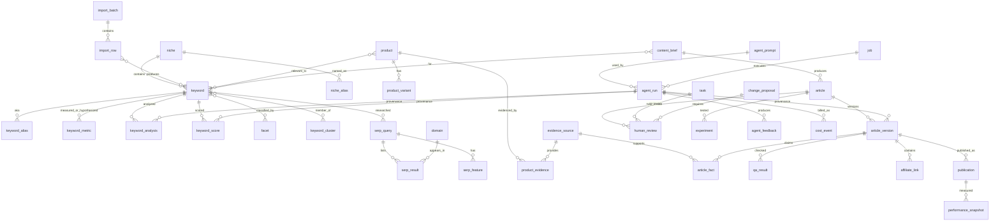

# DATABASE DESIGN

Status: **M2 planning — awaiting approval**
Date: 2026-08-25
Related: [ARCHITECTURE.md](./ARCHITECTURE.md) · [AGENTS.md](./AGENTS.md) · [SCORING.md](./SCORING.md) · [ADR-0003](./ADR/ADR-0003-drizzle-over-prisma.md) · [ADR-0004](./ADR/ADR-0004-pglite-local-postgres-prod.md) · [ADR-0013](./ADR/ADR-0013-forward-only-migrations.md)

Covers: database ERD (2), provenance model, M2 vs later tables, constraints.

---

## 1. Design rules

1. **PostgreSQL is the system of record.** Agents never pass untyped prose as the source of truth.
2. **UUID v7 primary keys** on every table. `created_at` / `updated_at` (`timestamptz`, UTC) on every table.
3. **Provenance columns** on every field-group that could be mistaken for a measurement (see §3).
4. **Soft status, never silent delete.** Operational rows use `status` enums. Hard deletes are reserved for GDPR-style erasure, which is out of M2.
5. **Forward-only migrations.** No `migrate down` in production. A failed migration is a new corrective migration ([ADR-0013](./ADR/ADR-0013-forward-only-migrations.md)).
6. **Design all spec entities; migrate only what M2 writes.** Unused tables freeze guesses. Later milestones add tables via numbered migrations. The ERD below is the full target spine; §6 marks `MIGRATE-M2` vs `DESIGN-ONLY`.

## 2. ERD (full spine)

## 3. Provenance primitive

Reusable column group (Drizzle mixin `withProvenance`):

| Column | Type | Meaning |
|--------|------|---------|
| `source_type` | enum | `MEASURED` · `HYPOTHESIS` · `DERIVED` · `MANUAL` · `UNAVAILABLE` |
| `source_name` | text | e.g. `m1-csv`, `keyword-agent`, `scoring-v1`, `gsc` |
| `source_url` | text nullable | External evidence URL when one exists |
| `source_ref` | text nullable | File hash, API request id, or row id of the origin |
| `confidence` | numeric(4,3) nullable | 0–1; null means “not applicable”, never “unknown treated as 1” |
| `value_status` | enum | `PRESENT` · `UNAVAILABLE` · `CONTRADICTED` · `STALE` |
| `observed_at` | timestamptz nullable | When the source claimed this, not when we stored it |
| `agent_run_id` | uuid nullable | FK to `agent_run` for AI- or formula-produced values |

Rule: **never store a number with `source_type = MEASURED` unless a retrieval record exists.** M1 CSV scores are `HYPOTHESIS`. Search volume that was never fetched is a row with `value_status = UNAVAILABLE`, or no row at all — never `0`.

## 4. Shared enums (M2)

| Enum | Values |
|------|--------|
| `keyword_status` | `IMPORTED` · `ANALYZED` · `SCORED` · `PARKED` · `REJECTED` |
| `niche_status` | `ACTIVE` · `PARKED` |
| `import_batch_status` | `PENDING` · `COMPLETE` · `PARTIAL` · `FAILED` |
| `import_row_status` | `ACCEPTED` · `REJECTED` · `DUPLICATE` |
| `agent_run_status` | `QUEUED` · `RUNNING` · `SUCCEEDED` · `INVALID_OUTPUT` · `FABRICATED_NUMERIC` · `FABRICATED_EXPERIENCE` · `BUDGET_EXCEEDED` · `FAILED` · `CACHED` |
| `intent_type` | `COMMERCIAL_INVESTIGATION` · `TRANSACTIONAL` · `INFORMATIONAL` · `MIXED` · `UNKNOWN` |
| `facet_kind` | `PRODUCT` · `USER` · `PROBLEM` · `ENVIRONMENT` · `USE_CASE` · `CONSTRAINT` · `ATTRIBUTE` |
| `pattern_type` | `BEST_X_FOR_Y` · `BEST_ATTRIBUTE_X` · `X_VS_Y` · `BEST_X_UNDER_PRICE` · `HOW_TO_CHOOSE_X` · `BUYING_GUIDE` · `OTHER` |
| `score_band` | `PROVISIONAL_HIGH` · `PROVISIONAL_MEDIUM` · `PROVISIONAL_LOW` · `INSUFFICIENT_DATA` |
| `job_status` | `PENDING` · `RUNNING` · `SUCCEEDED` · `FAILED` · `CANCELLED` |
| `task_status` | `TODO` · `IN_PROGRESS` · `BLOCKED` · `DONE` · `CANCELLED` |
| `actor_type` | `SYSTEM` · `HUMAN` · `AGENT` |

## 5. Table catalog

Every table has `id uuid PK`, `created_at`, `updated_at` unless noted.

### 5.1 M2 — migrated

#### `niche`

| Column | Type | Notes |
|--------|------|-------|
| `slug` | text unique | Canonical id, e.g. `problem-solving-gardening` |
| `name` | text | Display name from M1: `Problem-Solving Gardening` |
| `status` | `niche_status` | Only gardening is `ACTIVE` in M2 |
| `market` | text | `US` |
| `language` | text | `en-US` |

#### `niche_alias`

| Column | Type | Notes |
|--------|------|-------|
| `niche_id` | uuid FK | |
| `alias` | text unique | CSV label `Lawn & Garden` maps here (KD-03) |

#### `keyword`

| Column | Type | Notes |
|--------|------|-------|
| `niche_id` | uuid FK | |
| `raw_text` | text | Exact CSV string |
| `canonical_text` | text | Lowercased, collapsed whitespace, NFKC |
| `canonical_hash` | text unique | SHA-256 of `canonical_text` + market + language (idempotency) |
| `locale` | text | `en-US` |
| `market` | text | `US` |
| `status` | `keyword_status` | |
| `first_seen_import_batch_id` | uuid FK | Provenance of first appearance |

#### `keyword_alias`

Alternate surface forms discovered later (typos, pluralisation). Unique `(keyword_id, canonical_hash)`.

#### `import_batch`

| Column | Type | Notes |
|--------|------|-------|
| `source_path` | text | Relative path as invoked |
| `file_sha256` | text | Content hash (KD-01 audit) |
| `row_count` | int | Counted, never assumed 50 |
| `accepted_count` / `rejected_count` | int | |
| `status` | `import_batch_status` | |
| `actor` | text | Operator identity or `cli` |

Unique on `file_sha256` + importer version for idempotent re-import of the same bytes.

#### `import_row`

| Column | Type | Notes |
|--------|------|-------|
| `batch_id` | uuid FK | |
| `row_number` | int | 1-based data row |
| `raw_json` | jsonb | Unparsed-but-split columns |
| `row_hash` | text | Hash of canonicalised raw JSON |
| `status` | `import_row_status` | |
| `reject_reason` | text nullable | |
| `keyword_id` | uuid FK nullable | Set when ACCEPTED |

#### `keyword_metric`

Time-stamped metrics. M1 CSV fields land here as hypotheses.

| Column | Type | Notes |
|--------|------|-------|
| `keyword_id` | uuid FK | |
| `metric_name` | text | `m1_opportunity_score` · `m1_serp_opportunity` · `m1_source_rank` · `m1_research_priority` · later `search_volume` |
| `numeric_value` | numeric nullable | |
| `text_value` | text nullable | For `High`/`Medium`/`Y` |
| plus provenance mixin | | M1 rows: `source_type=HYPOTHESIS`, `source_name=m1-csv` |

Partial unique: one current row per `(keyword_id, metric_name, source_name)` where `superseded_at is null`.

#### `facet`

Controlled vocabulary. Seeded from M1 qualifiers plus grammar tokens.

| Column | Type | Notes |
|--------|------|-------|
| `kind` | `facet_kind` | |
| `slug` | text unique | `small-hands`, `raised-beds`, `beginners` |
| `label` | text | |
| `synonyms` | text[] | Matching surface forms |

#### `keyword_facet` (join)

`(keyword_id, facet_id)` unique, plus `role` (`PRIMARY`/`SECONDARY`) and `agent_run_id`.

#### `keyword_cluster`

| Column | Type | Notes |
|--------|------|-------|
| `niche_id` | uuid FK | |
| `slug` | text | e.g. `tomato-support` |
| `label` | text | |
| `method` | text | `facet-overlap-v1` |
| `method_version` | text | |

#### `keyword_cluster_member`

`(cluster_id, keyword_id)` unique, `is_primary` boolean (cluster head).

#### `keyword_analysis`

One current analysis per keyword (partial unique on `keyword_id` where `superseded_at is null`).

| Column | Type | Notes |
|--------|------|-------|
| `keyword_id` | uuid FK | |
| `pattern_type` | `pattern_type` | |
| `intent_type` | `intent_type` | |
| `product_text` | text nullable | Extracted X |
| `qualifier_text` | text nullable | Extracted Y or attribute |
| `user_text` / `problem_text` / `environment_text` / `constraint_text` | text nullable | |
| `confidence` | numeric(4,3) | Overall extraction confidence |
| `path` | text | `DETERMINISTIC` · `DETERMINISTIC_PLUS_LLM` · `LLM` |
| `related_candidates` | jsonb | Strings + origin; not invented volumes |
| `raw_output` | jsonb | Validated agent output |
| `agent_run_id` | uuid FK | |
| `superseded_at` | timestamptz nullable | |

#### `keyword_score`

| Column | Type | Notes |
|--------|------|-------|
| `keyword_id` | uuid FK | |
| `model_id` | text | `opportunity-v1` |
| `model_version` | text | `1.0.0` |
| `score` | numeric(6,3) nullable | Null iff `INSUFFICIENT_DATA` |
| `band` | `score_band` | |
| `data_completeness` | numeric(4,3) | 0–1 |
| `components` | jsonb | Named partials + weights |
| `missing_inputs` | text[] | Declared absences, never filled |
| `m1_hypothesis_score` | numeric nullable | Copied for side-by-side report only |
| `agent_run_id` | uuid FK nullable | Formula runs still get an `agent_run` with `model=deterministic` |
| `superseded_at` | timestamptz nullable | |

#### `agent_prompt`

| Column | Type | Notes |
|--------|------|-------|
| `agent_id` | text | `keyword` |
| `name` | text | `system` / `task` |
| `version` | text | Semver |
| `content_hash` | text | SHA-256 of prompt file |
| `content` | text | Immutable once inserted |
| `status` | text | `ACTIVE` · `RETIRED` |

Unique `(agent_id, name, version)`.

#### `agent_run`

| Column | Type | Notes |
|--------|------|-------|
| `agent_id` | text | |
| `agent_version` | text | Package version |
| `idempotency_key` | text unique | Hash of agent+version+prompt hashes+model+normalised input |
| `status` | `agent_run_status` | |
| `input_hash` | text | |
| `input_json` | jsonb | Size-capped; large blobs referenced |
| `output_json` | jsonb nullable | |
| `error_code` | text nullable | |
| `error_message` | text nullable | |
| `model` | text | `deterministic` or vendor model id |
| `provider` | text | `none` · `mock` · `openai` · `anthropic` |
| `input_tokens` / `output_tokens` | int | 0 for deterministic |
| `estimated_cost_usd` | numeric(12,6) | |
| `duration_ms` | int | |
| `started_at` / `finished_at` | timestamptz | |
| `parent_run_id` | uuid nullable | Repair attempt chain |
| `trace_id` | text | Correlates logs |

#### `cost_event`

Append-only ledger: `agent_run_id`, `provider`, `model`, tokens, `estimated_cost_usd`, `occurred_at`. Summed for budget guards.

#### `job`

In-process queue persistence so a crash can resume.

| Column | Type | Notes |
|--------|------|-------|
| `type` | text | `import` · `analyze-keyword` · `score-keyword` · `report` |
| `payload` | jsonb | |
| `status` | `job_status` | |
| `attempts` | int | |
| `last_error` | text nullable | |
| `idempotency_key` | text unique | |

#### `task`

Mirrors `docs/tasks.csv` so agents and humans share status ([ASSUMPTIONS.md](./ASSUMPTIONS.md) SI-06).

Columns match CSV: `external_id` (`M2-001`), `epic`, `milestone`, `title`, `description`, `dependencies`, `priority`, `estimated_hours`, `acceptance_criteria`, `validation_steps`, `double_check_steps`, `prompt_agent`, `automation_possible`, `human_action_required`, `status`, `checksum`.

#### `audit_event`

Append-only: `actor_type`, `actor_id`, `action`, `entity_type`, `entity_id`, `before` jsonb, `after` jsonb, `trace_id`. State changes (status transitions, prompt activation, score model activation) **must** write here. Application logs are not a substitute.

#### `human_review` (M2 stub)

Needed so the later gate does not require a rewrite. M2 seeds no reviews.

| Column | Type | Notes |
|--------|------|-------|
| `subject_type` / `subject_id` | text / uuid | Polymorphic |
| `decision` | text nullable | `APPROVED` · `REJECTED` · `CHANGES_REQUESTED` |
| `reason` | text nullable | |
| `reviewer` | text nullable | |
| `decided_at` | timestamptz nullable | |

#### `change_proposal` (M2 stub)

Empty in M2; schema exists so M9 cannot silently mutate prompts. Fields: `reason`, `evidence`, `expected_improvement`, `affected_components`, `risk`, `rollback_strategy`, `status` (`DRAFT`/`APPROVED`/`REJECTED`/`APPLIED`).

### 5.2 DESIGN-ONLY (not migrated in M2)

Created as documented sketches in this file and in `packages/database` README. First migration in the owning milestone.

| Table | Milestone | Purpose |
|-------|-----------|---------|
| `serp_query`, `serp_result`, `serp_feature`, `domain` | M3 | Retrieved SERP evidence; never claim a check without a row |
| `product`, `product_variant`, `product_evidence`, `evidence_source` | M4 | Products and typed evidence (`FACT`/`CLAIM`/`OPINION`/`INFERENCE`/`USER_EXPERIENCE`) |
| `content_brief` | M5 | Structured brief including “why this page deserves to exist” |
| `article`, `article_version`, `article_fact` | M5–M6 | Versioned content; facts linked to evidence |
| `qa_result` | M6 | Technical / fact / affiliate / SEO / content gates |
| `affiliate_link` | M6–M7 | Disclosure-safe link records |
| `publication` | M7 | WordPress draft/update mapping; default draft |
| `performance_snapshot` | M8 | GSC/Bing/Associates actuals |
| `experiment` | M9 | hypothesis, metric, baseline, change, result, decision |
| `agent_feedback` | M9 | Structured feedback per run |

Column-level sketches for these tables live in [docs/DATABASE_FUTURE.md](./DATABASE_FUTURE.md) so M2 migrations stay small. The future file is generated as part of planning (next section of this document’s appendix).

## 6. Indexes (M2 only)

| Table | Index | Why |
|-------|-------|-----|
| `keyword` | unique `canonical_hash` | Dedupe |
| `keyword` | `(niche_id, status)` | Active-niche pipeline |
| `keyword_metric` | `(keyword_id, metric_name)` where current | Score inputs |
| `keyword_analysis` | unique current per keyword | One live analysis |
| `keyword_score` | unique current per `(keyword_id, model_id)` | One live score |
| `agent_run` | unique `idempotency_key` | Cache |
| `import_batch` | `(file_sha256)` | Re-import |
| `facet` | unique `slug` | Lexicon lookup |
| `job` | `(status, created_at)` | Queue poll |
| `task` | unique `external_id` | CSV sync |

No speculative indexes. Explain plans when a query is slow.

## 7. Integrity constraints that encode product rules

- `keyword_metric.numeric_value` may be non-null only if `value_status = PRESENT`.
- `keyword_score.score` is null iff `band = INSUFFICIENT_DATA`.
- `keyword_score.missing_inputs` is empty iff `data_completeness = 1`.
- `agent_run.estimated_cost_usd >= 0`.
- `niche.status = ACTIVE` at most one row per `(market, language)` in M2 (application-enforced; documented for later multi-niche).
- Banned: defaulting `numeric_value` to `0` in migrations.

## 8. Seed data (M2)

1. Niche `problem-solving-gardening` ACTIVE; aliases `Lawn & Garden`.
2. Parked niches for the other four CSV labels.
3. Facet lexicon covering all qualifiers observed in the 44-row CSV (`small-hands`, `vegetable-garden`, `raised-beds`, `tomatoes`, `small-garden`, `beginners`, `elderly`, `lightweight`, plus product tokens extracted by the grammar).
4. Scoring model registry row `opportunity-v1` / `1.0.0`.
5. Tasks imported from `docs/tasks.csv`.

## 9. Test harness

`packages/database` exposes `createTestDb()`:

- Default: **PGlite** in-memory (or temp-file) with migrations applied.
- Optional: `DATABASE_URL` against real Postgres for parity job M2-042.
- Each test gets a fresh schema or truncated tables; no shared global state.
- Fixture loader for the M1 CSV and malformed CSV variants.

## 10. Backup and OneDrive

PGlite file databases must **not** live under OneDrive if the repo stays there (DN-01). Config default: `data/pglite` gitignored, with a documented override to a local non-synced path. Staging/prod uses a hosted Postgres dump schedule (human task, not M2 code).
